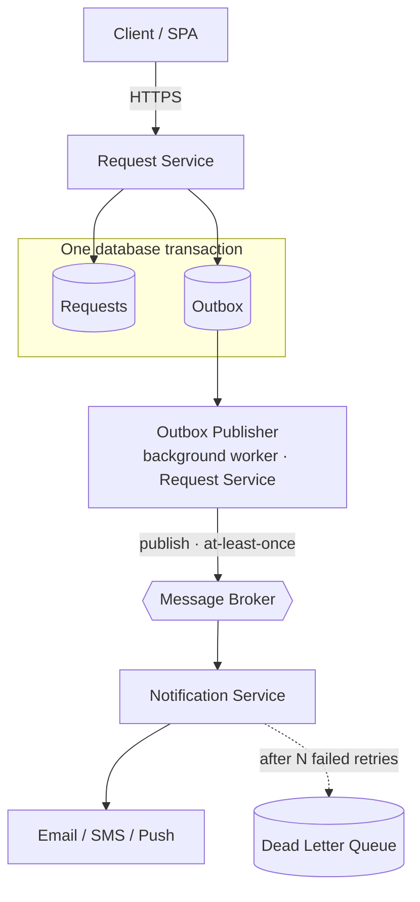

# Architecture — Scaling the Requests System

How the system would evolve, and how notifications stay reliable when the channel is unavailable.

## Current State

A single ASP.NET Core service owning one `Request` entity. Search, filtering, sorting, paging and
authorization are composed through EF Core and applied before the query is materialized, rather than
to an already-loaded list. The provider is EF Core InMemory, which does not offer the transactional
guarantees the Transactional Outbox depends on, so the design below assumes a relational database.

## Target Architecture

## Service Responsibilities

- **Request Service** — request business rules and authorization, creation and status changes,
  search and pagination, persistence, and writing integration events to the Outbox.
- **Notification Service** — consuming those events, building and sending notifications through
  email, SMS or push, retrying failures, and processing idempotently.

## Reliable Notifications

Creating a request or changing its status emits a `RequestCreated` or `RequestStatusChanged` event
carrying a unique `eventId`, the `requestId`, and the user IDs concerned (owner and assignee), so the
Notification Service can resolve recipients without calling back into the Request Service.

1. **Atomic write** — the request change and its Outbox event are committed in the same database
   transaction, so neither can exist without the other.
2. **Publish** — a background publisher inside the Request Service reads unprocessed Outbox rows and
   publishes them to a broker configured for durable, persistent messaging. A row is marked processed
   only after the broker acknowledges it; if the broker is unavailable the publish fails, the row
   stays unprocessed, and the publisher retries later. If the consumer is down, messages simply wait.
3. **Consume** — the Notification Service receives the event and builds the notification.
4. **Idempotency** — it records handled `eventId`s and skips any it has already processed.
5. **Retry and dead-letter** — transient failures are retried with backoff; after a bounded number
   of attempts the message moves to a dead letter queue for inspection and replay.

Delivery is **at-least-once, not exactly-once**: a publisher that crashes after a broker
acknowledgement but before marking the row processed will publish again. `eventId` deduplication
prevents repeated *internal* processing, but an email or SMS provider cannot join the consumer's
transaction — a crash after the provider accepts a message but before success is recorded will
re-send on redelivery. We prefer that rare duplicate to recording success first, which could silently
lose a notification. Idempotent processing minimizes duplicate effects without claiming exactly-once
delivery.

## Why This Approach

- **Synchronous HTTP** couples request availability to notification availability: if notifications
  are down, either the user's operation fails or the notification is lost.
- **Retries alone are not durable** — retry state lives in memory, so a deploy or crash mid-retry
  loses the event permanently.
- **A broker without an Outbox** leaves the dual-write problem: the database and broker share no
  transaction, so either ordering can drop an event or emit one for a rolled-back change.

## Trade-offs

| Benefits | Costs |
|---|---|
| Loose coupling, failure isolation, independent scaling and deployment, durable delivery at every hop | Eventual consistency, more operational complexity, and mandatory duplicate handling plus monitoring of Outbox backlog and DLQ depth |

## Why Two Services

Requests and notifications have genuinely different responsibilities, failure modes and scaling
profiles, and depend on different external systems. That makes them a real boundary. Nothing else
warrants extraction today; a further service should be split out only when a concrete requirement —
independent scaling, a separate deployment cadence or availability target, or a distinct owning team
— actually appears.
